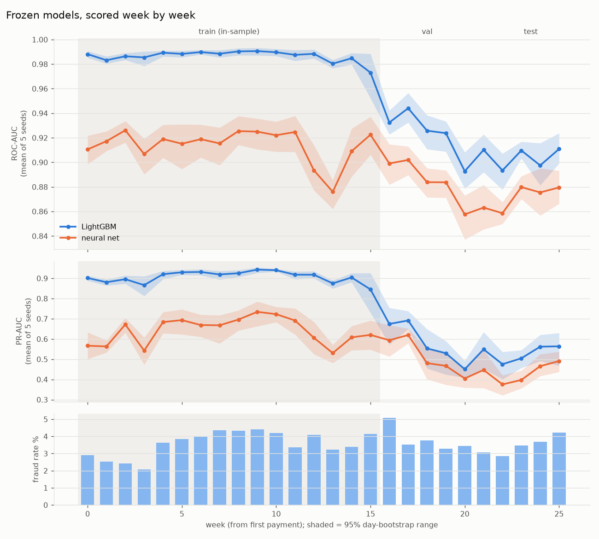
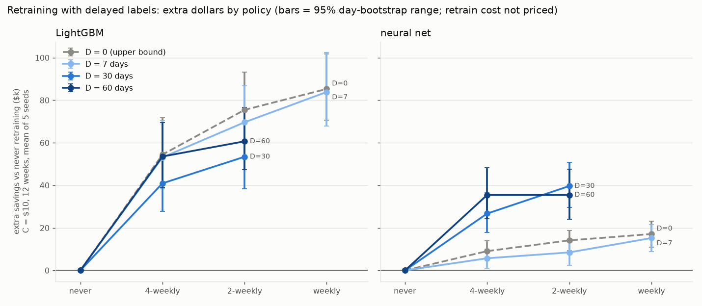

# Fraud detection: LightGBM vs a neural network (IEEE-CIS)

## Summary

This project compares two models on the public IEEE-CIS card-payment fraud data (about 3.5% of payments are fraud):
LightGBM (a tree-based model) and a neural network. Both get the same features and the same tuning effort, and they
are tested on a later stretch of time than they trained on (a time-based split, never a random one). It is an offline
simulation, not a deployed system. On the one locked test evaluation (30 days, 5 seeds each) LightGBM ranks payments
better, with ROC-AUC 0.905 vs 0.875, and under an assumed $10 review cost per flagged payment the LightGBM rule saves
about $283k of $452k fraud dollars (95% range $241k to $329k). The network's range ($226k to $316k) overlaps, so
this project does not claim either model saves more dollars. LightGBM's lead comes mostly from clients it has seen
before (gap about 0.057 ROC-AUC); on new clients the gap is about 0.006 (validation, checked after the fact, see
DECISIONS.md A1).

## Results

Terms, defined once:
- **ROC-AUC**: the chance that a randomly picked fraud payment gets a higher score than a randomly picked normal one.
  0.5 is a coin flip, 1.0 is perfect ranking.
- **PR-AUC**: how well the top-scored payments are actually fraud, averaged over cut-offs. A coin flip scores about
  the fraud rate (0.035), so it is much lower than ROC-AUC on rare fraud.
- **Savings**: fraud dollars caught, minus $10 for every payment flagged for review. Assumes a caught fraud is fully saved.
- **Flag rule**: flag a payment if (calibrated fraud probability x amount) is above $10.
- **Precision**: the share of flagged payments that are really fraud.

### Single locked test evaluation (run once; 5 seeds each; mean +- spread between seeds)

| test block, 30 days | LightGBM | neural network |
|---|---|---|
| ROC-AUC | 0.9053 +- 0.0023 | 0.8754 +- 0.0034 |
| PR-AUC | 0.5362 +- 0.0041 | 0.4377 +- 0.0145 |
| Savings at $10 per flag | $283,448 +- $2,750 | $268,506 +- $1,201 |
| Savings, 95% range (resampling whole days) | $241k to $329k | $226k to $316k |
| Fraud dollars caught | 81.2% | 78.8% |
| Precision / flags per day | 0.208 / 278 | 0.178 / 292 |

Test block: 84,233 payments, $451,813 of fraud. The 95% ranking-gap range (LightGBM minus network) was 0.0245 to
0.0350 ROC-AUC, and no resampled draw had the network ahead. The savings gap was not tested, so it is not established.

### Exploratory (not held-out)

These phases re-use months that earlier phases had already seen. They describe; they do not prove.

**Phase 6, drift.** Models were frozen after training and scored week by week.



LightGBM ROC-AUC was 0.944 in week 17 (the first validation week) and 0.893 to 0.911 in weeks 20 to 25; the network
went from 0.902 to 0.858-0.880 over the same weeks. The fall is front-loaded and weeks 22-25 are roughly flat, so
"steady decay" would overstate it.

**Phase 8, retraining with delayed labels.** Retrain on a schedule using only labels that would have arrived by then
(delay D of 7, 30 or 60 days), over one 12-week stretch (84 days, $1.44M of fraud). Extra savings over never retraining:



Retraining paid in all 20 policy and delay combinations (every 95% range was above 0), for both models. The smallest
gain was the network at D = 7, 4-weekly: +$6k (range $1k to $10k; some single seeds lost money). At D = 30 with
4-weekly retraining, LightGBM gained +$41k ($28k to $55k) and the network +$27k ($18k to $37k).
Slower labels reduced savings by more than retraining recovered, so label speed matters more than the retraining
schedule: LightGBM with 4-weekly retraining saved $959k at D = 7 and $840k at D = 60, a $119k loss, against
retraining gains of $41k to $54k. The cost of retraining itself is not counted.

## Limits

- **The $10 review cost is an assumption.** Every dollar figure depends on it. It also leaves out customer annoyance
  and any limit on how many payments a team can review.
- **Precision is about 21%.** At the headline setting (about 278 flags a day) about 1 flag in 5 is fraud, so 4 in 5
  flagged payments are legitimate. The 81% fraud-dollars figure belongs to that setting, not to the model.
- **LightGBM's lead comes mostly from returning clients.** On validation, gap in ROC-AUC (LightGBM minus network):
  0.057 for clients already seen in training (95% range 0.048 to 0.066), 0.006 for new clients (-0.001 to 0.012).
  This was checked after the fact, on validation only, and clients are matched by an approximate key.
- **Drift.** The model is frozen. Both models scored lower weeks after training than right after it (see above).
- **Retraining simulation.** It ignores the cost of retraining, covers one 12-week stretch, and reuses months that
  earlier phases had already looked at (including validation and the test block).
- **Label delay is not in the main result.** The 7-day gaps between train, validation and test do not model label
  delay; real chargebacks can take weeks or months. Phase 8 tests this and shows savings fall as delay grows.
- Validation chose both models' settings and stopping points, so validation scores are optimistic by an unknown amount.
  Only the test numbers are quoted as results.

## How to run

You need the Kaggle IEEE-CIS data (not redistributable, not in this repo). Everything under `data/` and `models/`
is git-ignored, so a fresh clone has no trained models. Steps, in order:

1. **Install** (Python 3.12; versions are pinned because refit checks compare scores exactly):
   ```bash
   python3.12 -m venv .venv && .venv/bin/pip install -r requirements.txt
   ```
2. **Download data**: put the Kaggle CSVs in `data/raw/`.
3. **Tests** (about 5 minutes, needs the data):
   ```bash
   .venv/bin/python -m pytest -v -rs
   ```
4. **Train the models the service uses** (run each as its own process). The Phase 5 fit
   writes `models/phase5/`; I did not record how long these steps take:
   ```bash
   .venv/bin/python -m src.business fit lgbm
   .venv/bin/python -m src.business fit nn
   .venv/bin/python -m src.business choose
   ```
   The one-time test run (`src.business test`) is not needed for the service.
5. **Export the service model** (writes `models/service/`; scores nothing):
   ```bash
   .venv/bin/python -m src.export
   ```
6. **Build and run the API** (only works after step 5, because the model is mounted from `models/service/`; image is
   about 649 MB):
   ```bash
   docker build -t fraud-score:local .
   docker run --rm -p 8000:8000 -v "$PWD/models/service:/models:ro" fraud-score:local
   ```
7. **Score an invented example** (not a dataset row):
   ```bash
   curl -s -X POST localhost:8000/score -H 'content-type: application/json' \
     -d '{"TransactionAmt": 149.5, "ProductCD": "W", "card4": "visa", "card6": "debit", "C1": 2, "C2": 1}'
   ```
   It returns a probability, an expected loss and a flag. The $10 review cost is an assumption you can change with
   `REVIEW_COST` or `?review_cost=`. Details: `docs/SERVICE.md`.

## Repo layout

- `src/`: data loading, time split, both models, comparison, cost and calibration, drift, retraining, export.
- `service/`: the FastAPI app that serves one frozen LightGBM model.
- `tests/`: checks for leakage, determinism and service parity.
- `scripts/`: manual Docker smoke test and latency measurement.
- `metrics/`: aggregate results (JSON) for every phase; the source of every number above.
- `reports/`: the charts.
- `notebooks/`: exploratory analysis, aggregates only, no raw rows.
- `docs/`: service documentation.
- `DECISIONS.md`: every non-obvious choice, with the reason, plus predictions, results and an audit of the claims.
- `data/`, `models/`: git-ignored (data is not redistributable; models are built from it).
